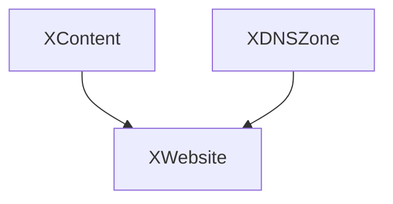

# platform-ref-s3-website

This repository defines a [Crossplane configuration package](https://docs.crossplane.io/v1.11/concepts/packages/#configuration-packages) that demonstrates provisioning and hosting static s3 websites.

## Composition Overview

This reference platform Configuration for Amazon S3 static website hosting
is a starting point to build, run, and operate Amazon S3 to host a static website.
On a static website, individual webpages include static content.
They might also contain client-side scripts.



- [XWebsite](apis/XWebsite/): creates s3,cdn,acm,route53 configuration for static website hosting
  - [XContent](apis/XContent/): creates s3 object for static website hosting
  - [XDNSZone](apis/XDNSZone/): creates route53 public DNS Zone (use only if needed)
  
## Deploying the Reference Platform

First you will need access to a Kubernetes cluster. Ensure you are
using the correct context:

```sh
kubectl config current-context
```

Next, we'll use the `up` binary to install UXP, Upbound's distribution of
Crossplane. To get `up`, follow the [installation instructions](https://docs.upbound.io/uxp).

To install UXP using `up` run:

```console
up uxp install
UXP 1.12.1-up.1 installed
```

Install the AWS Provider:

```console
kubectl apply -f examples/provider-aws-scoped.yaml

provider.pkg.crossplane.io/provider-family-aws created
provider.pkg.crossplane.io/provider-aws-acm created
provider.pkg.crossplane.io/provider-aws-cloudfront created
provider.pkg.crossplane.io/provider-aws-route53 configured
provider.pkg.crossplane.io/provider-aws-s3 created
```

You can keep track of the provider install:

```console
kubectl get -f examples/provider-aws-scoped.yaml  
```

All the providers should be `INSTALLED` and `HEALTHY` within a minute or two:

```console
providerrevision.pkg.crossplane.io/provider-aws-acm-cd915da2bc0f          True      1          xpkg.upbound.io/upbound/provider-aws-acm:v0.37.0          Active   1           1               113m
providerrevision.pkg.crossplane.io/provider-aws-cloudfront-9da29e4a8982   True      1          xpkg.upbound.io/upbound/provider-aws-cloudfront:v0.37.0   Active   1           1               113m
providerrevision.pkg.crossplane.io/provider-aws-route53-27d581b1b384      True      1          xpkg.upbound.io/upbound/provider-aws-route53:v0.37.0      Active   1           1               113m
providerrevision.pkg.crossplane.io/provider-aws-s3-dbc7f981d81f           True      1          xpkg.upbound.io/upbound/provider-aws-s3:v0.37.0           Active   1           1               113m
providerrevision.pkg.crossplane.io/provider-family-aws-d095ac1e13dd       True      1          xpkg.upbound.io/upbound/provider-family-aws:v0.37.0       Active                               7d4h
```

Next, install the CompositeResourceDefinitions and Compositions:

```console
kubectl apply -f apis/XContent
kubectl apply -f apis/XWebsite
```

The Custom Platform APIs are Kubernetes `CompositeResourceDefinition` objects or `XRD`
for short. We can list them using `kubectl`:

```console
kubectl get xrd
```

The following XRDs should be `ESTABLISHED` and `OFFERED`:

```console
NAME                                       ESTABLISHED   OFFERED   AGE
xwebsites.example.upbound.io               True          True      109m
xcontents.example.upbound.io               True          True      109m
```

## Authenticating to AWS

Now that Crossplane, the Provider and all the Compositions are installed we
need to give the provider AWS credentials. This is done by creating a `ProviderConfig`.

There are many options we can use to authenticate to AWS, but to sim

```sh
kubectl create secret generic aws-creds -n upbound-system --from-file=creds=./creds.conf
```

### Configure the Provider with AWS Credentials

We will create the following `ProviderConfig` object to use the AWS credentials
from the previous step. See [AUTHENTICATION](https://github.com/upbound/provider-aws/blob/main/AUTHENTICATION.md) for more authentication options like IRSA.

```yaml
apiVersion: aws.upbound.io/v1beta1
kind: ProviderConfig
metadata:
  name: default
spec:
  credentials:
    source: Secret
    secretRef:
      namespace: upbound-system
      name: aws-creds
      key: creds
```

```console
kubectl apply -f examples/providerconfig-creds.yaml
```

We're now ready to deploy the examples.

Using files in the `examples` directory:

```console
kubectl apply -f ns.yaml
kubectl apply -f examples/website.yaml
kubectl apply -f examples/content.yaml
```

Applying the examples to the cluster would create Kubernetes objects similar
to the following:

```console
kubectl get websites
```

```console
NAME                                     SYNCED   READY   COMPOSITION                    AGE
xcontent.example.upbound.io/demo-9fsxm   True     True    xcontents.example.upbound.io   4m21s

NAME                                        DOMAIN                        ENABLED   SYNCED   READY   COMPOSITION                    AGE
xwebsite.example.upbound.io/website-vdc75   demo.website.upbound.io       true      True     True    xwebsites.example.upbound.io   37m
```

## Cleaning Up

To Clean up the installation, run the following commands:

```console
kubectl delete -f examples/content.yaml
kubectl delete -f examples/website.yaml
```

Wait for all the cloud resources to be deleted:

```console
kubectl get managed
```

Delete the Compositions, Providers, and ProviderConfig after all the resources have been deleted.

```console
kubectl delete -f ns.yaml
kubectl delete -f apis/XWebsite
kubectl delete -f apis/XContent
kubectl delete -f examples/providerconfig-creds.yaml
kubectl delete -f examples/provider-aws-scoped.yaml
```

## Local Development

This reference platform is a starting point to help you build your own
Platform APIs.

The following sections will detail how to make, test, and publish
modifications to these compositions.

### Setting Up the Build Environment

Clone this repository:

```console
git clone https://github.com/upbound/platform-ref-s3-website
```

Next pull in the Upbound [build](https://github.com/upbound/build) as a git submodule:

```console
cd platform-ref-s3-website
make submodules
Submodule 'build' (https://github.com/upbound/build) registered for path 'build'
Cloning into '/home/user/platform-ref-s3-website/build'...
Submodule path 'build': checked out '292f958d2d97f26b450723998f82f7fc1767920c'
```

Next run `make`. This will download the required components:

```sh
make
```

### Applying your Updated Compositions to a Cluster

### Automated Testing Using Uptest

[Uptest](https://github.com/upbound/uptest) is used for end to end testing of the
Compositions in this repository. It does this by provisioning example claims and
waiting for them to become `READY`.

To run uptest locally, first set the `UPTEST_CLOUD_CREDENTIALS` environment variable
with the contents of an AWS credentials file:

```sh
export UPTEST_CLOUD_CREDENTIALS=$(cat ~/.aws/credentials)
```

With the credentials file of the following format:

```ini
[default]
aws_access_key_id=AKIA...
aws_secret_access_key=jQplCPbh...
```

```sh
make e2e
```

## Questions?

For any questions, thoughts and comments don't hesitate to reach out or drop by slack.crossplane.io, and say hi!
